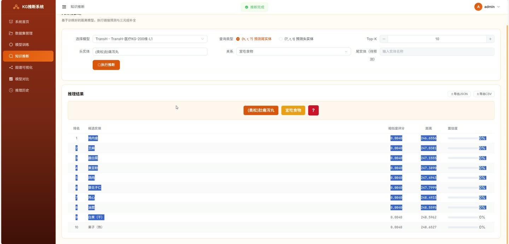
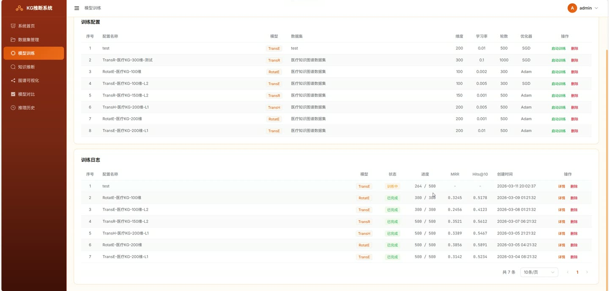
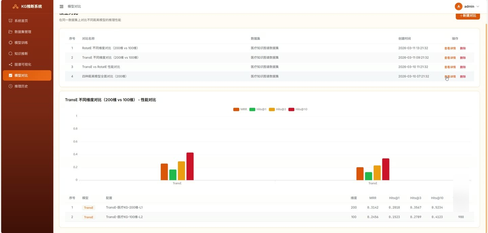
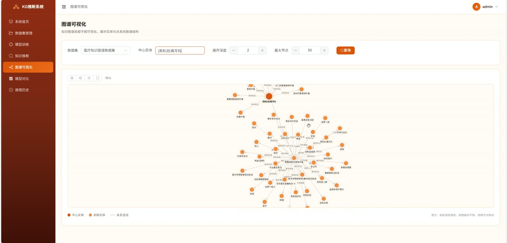
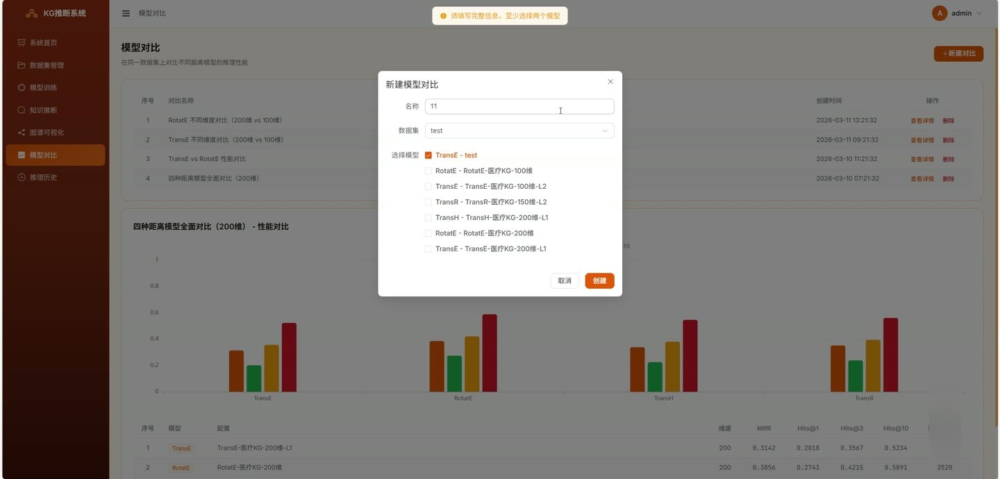

# (附文档)Python+深度学习+PyTorch 基于知识图谱距离模型的知识推断系统

**技术栈**：Python、Flask、PyTorch、深度学习、Vue3、MySQL

### 系统简介

本系统是一套基于知识图谱距离模型的医疗知识推断平台，采用前后端分离架构，后端使用 Flask 提供 RESTful 接口并集成 PyTorch 深度学习训练与推理引擎，前端使用 Vue3 构建单页应用，数据存储于 MySQL。系统围绕知识图谱数据集管理、距离模型训练、链接预测推理、图谱可视化与模型对比展开，包含普通用户端与管理员端两类角色。
 
### 核心功能
 
### 普通用户端

 
- 账号注册：填写用户名、邮箱、密码与确认密码，前端校验用户名 3-20 字符、密码不少于 6 位且两次一致。 
- 账号登录：输入用户名与密码登录，登录成功后跳转系统首页，登录页展示演示账号可一键填充。 
- 系统首页概览：展示数据集、训练任务、推理记录、模型数量四类统计卡片，点击可跳转对应页面。 
- 快捷操作入口：提供加载数据集、训练模型、知识推断、图谱可视化四个快捷入口卡片。 
- 核心模型展示：首页列出 TransE、RotatE、TransH、TransR 四种距离模型的名称与公式说明。 
- 数据集管理：分页展示数据集列表，支持按名称关键字搜索，展示实体数、关系数、三元组数与状态。 
- 加载内置数据集：一键加载内置医疗知识图谱数据集 medical_kg。 
- 创建数据集：填写名称与描述，上传 zip/txt/csv/json 数据文件，支持拖拽上传与格式说明提示。 
- 数据集详情：查看实体数、关系数、三元组总数、训练集、验证集、测试集统计，并预览前 20 条三元组。 
- 删除数据集：对列表中的数据集执行删除确认操作。 
- 新建训练配置：选择 TransE/RotatE/TransH/TransR 模型与数据集，设置嵌入维度、学习率、训练轮数、批次大小、Margin、负采样数、优化器、距离范数。 
- 启动训练：对已有训练配置一键启动训练任务，并自动轮询刷新训练日志状态。 
- 训练日志管理：分页展示训练日志，显示配置名称、模型、状态、进度、MRR、Hits@10 与创建时间。 
- 训练详情查看：进入单条训练日志详情页查看训练过程与指标。 
- 知识推断：选择已训练完成的模型，设置查询类型为 (h,r,?) 预测尾实体或 (?,r,t) 预测头实体，设置 Top-K 数量。 
- 实体自动补全：输入头实体或尾实体时按关键字从数据集实体中自动补全候选。 
- 关系选择：根据所选模型对应数据集动态加载关系列表并支持筛选选择。 
- 推理结果展示：以表格展示排名、候选实体、相似度评分、距离与置信度进度条。 
- 推理结果导出：支持将单次推理结果导出为 JSON 或 CSV 文件。 
- 推理历史管理：分页查看历史推理记录，展示模型、查询类型、头实体、关系、尾实体、Top-K 与查询时间。 
- 推理历史详情：弹窗展示查询三元组结构与候选实体排名、评分、距离明细。 
- 推理历史导出：支持单条记录导出 JSON，以及勾选多条记录批量导出 JSON。 
- 图谱可视化：进入图谱可视化页面查看子图展示。 
- 模型对比：新建对比任务，选择同一数据集与至少两个已完成训练日志进行性能对比。 
- 对比结果展示：以柱状图与表格展示各模型的 MRR、Hits@1、Hits@3、Hits@10 与训练时长。 
- 对比记录管理：查看对比详情并支持删除对比记录。
 
### 管理员端

 
- 管理员账号登录：使用管理员账号登录系统后台，登录页提供管理员演示账号入口。 
- 用户数据管理：通过用户表维护用户名、邮箱、头像、创建时间与更新时间等账号信息。 
- 数据集全局管理：查看与管理平台内全部数据集及其实体、关系、三元组统计信息。 
- 训练配置管理：查看与管理全部训练配置，包括模型类型、数据集、嵌入维度与优化器参数。 
- 训练日志监控：查看全部训练任务的状态、进度、损失历史与评估指标。 
- 推理结果管理：查看平台内推理结果记录及候选实体评分明细。 
- 模型对比管理：查看与管理模型对比记录及其对比数据。
 
### 技术栈

 后端框架Python + Flask 深度学习框架PyTorch ORMFlask-SQLAlchemy 认证与权限Flask-JWT-Extended，基于 JWT 的用户身份校验 密码安全Werkzeug 密码哈希 前端框架Vue3 前端路由Vue Router 状态管理Pinia UI 组件库Element Plus 图表可视化ECharts 构建工具Vite 数据库MySQL
 
### 交付内容

 
- 后端完整源码 
- 前端完整源码 
- 数据库初始化脚本 
- 万字文档

## 界面展示

---

## 获取完整源码 + 万字文档

本仓库为项目介绍页。**完整前后端源码、数据库初始化脚本、万字项目文档**，请加微信 `kangkangcode`，或访问 [codekk.top](http://codekk.top) 获取。

可作课程设计 / 毕业设计参考，支持远程部署调试。